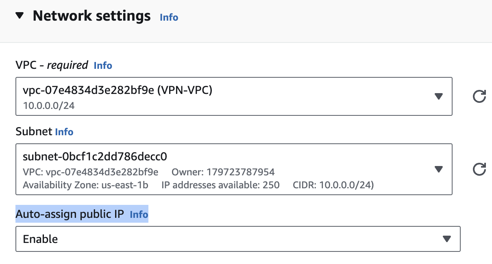
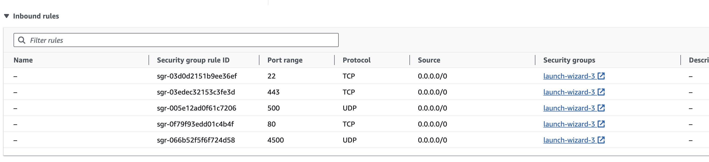
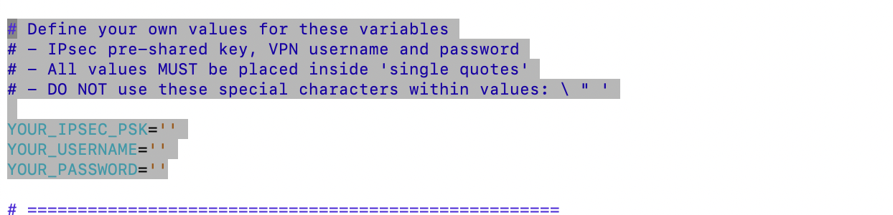
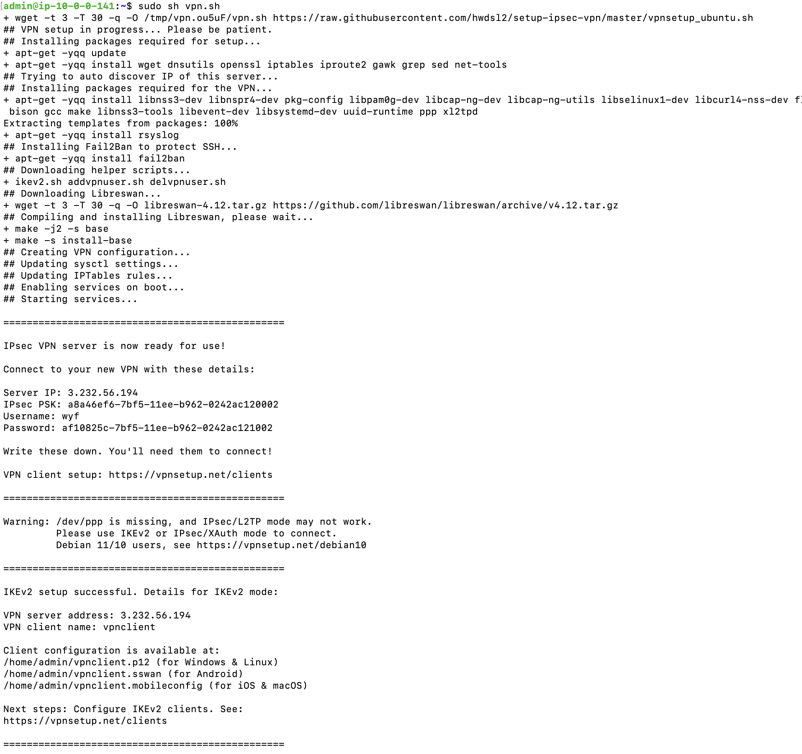

## IPSec VPN 安装步骤

IPSec VPN的安装主要分三个步骤：
1. 初始化配置服务器  
2. 服务器(Linux)上IPSec的安装  
3. 客户端(windows端)IKEv2 VPN的安装  

本文一步步讲解，这几个步骤

### 初始化配置服务器
1. 创建VPN账户
    - root用户登陆后创建一个专门用于VPN配置的用户，并赋予XX权限
    - 退出root用户，用刚创建的专门用于VPN的用户登陆AWS
2. 创建EC2实例，
    - 选Linux的Debian版本
    - 配置Public IP auto assign
    
    - 创建一个Key Pair（RSA Type，.pem文件类型），用于SSH连接。创建Key Pair的时候会自动下载这个文件到本地。
    - 配置EC2的Security Group，inbound rules，TCP要开放22，443，80端口，UDP开放4500，500端口。这个步骤可以在实例创建后再配置
    
3. 连接EC2
    - Terminal里面进入Key Pair文件所在目录。
    - 执行如下命令：`chmod 400 YourKeyPairFileName.pem`
    - 连接EC2：`ssh -i "YourKeyPairFileName.pem" admin@publicIP`

### 服务器(Linux)上IPSec的安装
1. 更新服务器： `sudo apt-get update && sudo apt-get dist-upgrade`
2. 重启服务器：`sudo reboot`
3. 获取安装IPSec软件脚本：`wget https://get.vpnsetup.net -O vpn.sh`
4. 打开脚本：`vi vpn.sh`
5. 替换：`YOUR_IPSEC_PSK, YOUR_USERNAME 和 YOUR_PASSWORD`后保存，退出

6. 运行安装脚本`sudo sh vpn.sh`
7. 如果屏幕出现类似下图的内容，表示IPSec服务器端已经配置完成

### 客户端(windows端)IKEv2 VPN的安装
如果客户端是运行在Windows上的：
1. 在EC2实例上找到vpnclient.p12文件，下载到本地。
    - Terminal新开一个窗口，运行命令：  
    `scp -i YourKeyPairFileName.pem admin@publicIP:ServerSidePath/vpnclient.p12 .`  
2. 下载配置导入脚本[ikev2_config_import.cmd](https://github.com/hwdsl2/vpn-extras/releases/latest/download/ikev2_config_import.cmd)到本地，和vpnclient.p12文件放同一个目录。
3. 右键单击保存的脚本，选择“属性”。单击对话框下方的“解除锁定”，然后单击“确定”
4. 右键单击保存的脚本，选择”以管理员身份运行“
5. 屏幕出现“VPN Client Name：”， 直接回车即可
6. VPN Server Address：输入AWS EC2 的Public IP
7. “IKEv2 Connection Name“，直接回车即可
8. 如果屏幕出现“IKEv2 configuration successful imported”，表示客户端运行成功。
9. 单击系统托盘中的无线/网络图标，选择新的“VPN 连接”，然后单击“连接”。
10. 连接成功后，你可以到[这里](https://www.ipchicken.com/) 检测你的 IP 地址，应该显示为你的 AWS EC2的Public IP
